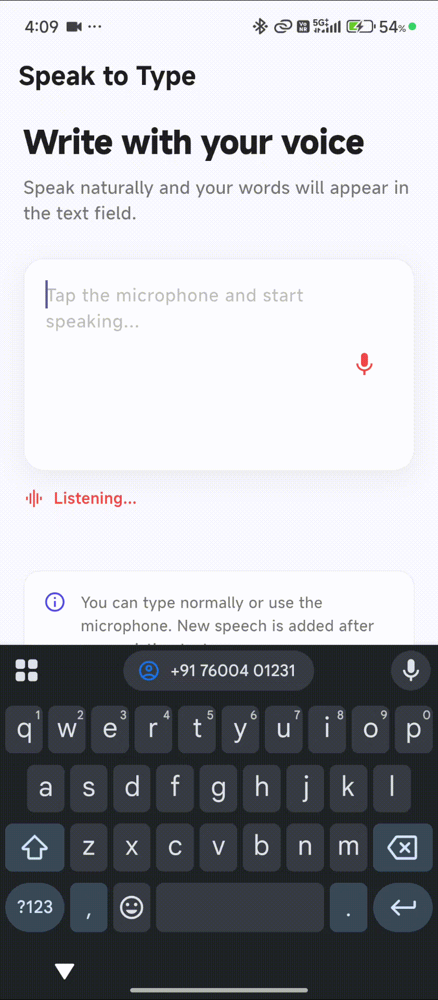

# 🎙️ Flutter Speak to Type

A customizable Flutter speech-to-text input package that allows users to **type normally or convert spoken English into text directly inside a text field**.

The package provides a reusable text field with an integrated microphone button, listening state, speech result callbacks, and customizable styling.

<p align="center">
  
</p>

## Features

* 🎤 Speech-to-text input
* ⌨️ Normal text typing
* 📝 Add spoken text directly into the text field
* 🔴 Listening state indicator
* 🔄 Start and stop speech recognition
* 💬 Speech result callback
* ✏️ Text change callback
* 🎨 Custom microphone color
* 🔴 Custom listening color
* 🖌️ Custom text style
* 📝 Custom hint style
* 🎛️ Custom `InputDecoration`
* 📏 Single-line text field support
* 📄 Multi-line text field support
* 🎮 External `TextEditingController`
* ⚡ Lightweight and easy to integrate
* 🛡️ Speech recognition error handling
* 📱 Android microphone permission support
* 🍎 iOS speech recognition support

## Preview

[Flutter Speak to Type Demo](https://github.com/Excelsior-Technologies-Community/flutter_speak_to_type/blob/stage/example/assets/demo.gif)

<p align="center">
  
</p>

## Installation

Add the package to your `pubspec.yaml`.

### Local Package

```yaml
dependencies:
  flutter_speak_to_type:
    path: ../
```

### Pub.dev

After publishing the package, add the latest version:

```yaml
dependencies:
  flutter_speak_to_type: ^1.0.0
```

Then run:

```bash
flutter pub get
```

## Dependencies

The package uses:

```yaml
dependencies:
  flutter:
    sdk: flutter

  speech_to_text: ^7.3.0
```

## Basic Usage

Import the package:

```dart
import 'package:flutter_speak_to_type/flutter_speak_to_type.dart';
```

Add the `SpeakToTypeField`:

```dart
SpeakToTypeField(
  hintText: 'Start speaking...',
)
```

The widget provides a text field with an integrated microphone button.

Tap the microphone and speak. The recognized English speech is added to the text field.

## Complete Example

```dart
import 'package:flutter/material.dart';
import 'package:flutter_speak_to_type/flutter_speak_to_type.dart';

class SpeakToTypePage extends StatelessWidget {
  const SpeakToTypePage({super.key});

  @override
  Widget build(BuildContext context) {
    return Scaffold(
      appBar: AppBar(
        title: const Text('Speak to Type'),
      ),
      body: const Padding(
        padding: EdgeInsets.all(16),
        child: SpeakToTypeField(
          hintText: 'Tap the microphone and start speaking...',
          maxLines: 5,
        ),
      ),
    );
  }
}
```

## Using TextEditingController

You can provide your own `TextEditingController` when you need to access or control the text.

```dart
final TextEditingController controller = TextEditingController();

SpeakToTypeField(
  controller: controller,
  hintText: 'Speak something...',
)
```

Read the current text:

```dart
print(controller.text);
```

Clear the text:

```dart
controller.clear();
```

## Adding Speech to Existing Text

The package can add spoken text after the text that is already present in the field.

For example, if the existing text is:

```text
Hello
```

and the user speaks:

```text
How are you?
```

the text becomes:

```text
Hello How are you?
```

This allows users to continue writing without removing their existing content.

## Listening State

Use `onListeningChanged` to detect when speech recognition starts or stops.

```dart
SpeakToTypeField(
  onListeningChanged: (isListening) {
    print('Listening: $isListening');
  },
)
```

The callback returns:

```text
true  → Speech recognition is active
false → Speech recognition has stopped
```

You can use this to display your own listening indicator:

```dart
bool isListening = false;

SpeakToTypeField(
  onListeningChanged: (value) {
    setState(() {
      isListening = value;
    });
  },
)
```

## Speech Result

Use `onSpeechResult` to receive the recognized speech.

```dart
SpeakToTypeField(
  onSpeechResult: (text) {
    print('Speech: $text');
  },
)
```

This is useful when your application needs to perform additional work with the recognized text.

For example:

* Search
* Commands
* Form input
* Notes
* Messages
* Voice-based input

## Text Changes

Use `onChanged` to receive text changes from both normal typing and speech input.

```dart
SpeakToTypeField(
  onChanged: (value) {
    print('Current text: $value');
  },
)
```

This behaves similarly to the standard Flutter `TextField` `onChanged` callback.

## Multi-line Input

The field supports multi-line text input using `maxLines`.

```dart
SpeakToTypeField(
  hintText: 'Write or speak something...',
  maxLines: 5,
)
```

For a larger text area:

```dart
SpeakToTypeField(
  hintText: 'Enter your description...',
  maxLines: 10,
)
```

## Custom Styling

### Microphone Color

Customize the microphone icon color:

```dart
SpeakToTypeField(
  micColor: Colors.blue,
)
```

### Listening Color

Customize the microphone color while speech recognition is active:

```dart
SpeakToTypeField(
  micColor: Colors.grey,
  listeningColor: Colors.red,
)
```

### Text Style

Customize the text appearance:

```dart
SpeakToTypeField(
  textStyle: const TextStyle(
    fontSize: 16,
    fontWeight: FontWeight.w500,
  ),
)
```

### Hint Style

Customize the hint:

```dart
SpeakToTypeField(
  hintText: 'Speak something...',
  hintStyle: const TextStyle(
    fontSize: 15,
    color: Colors.grey,
  ),
)
```

## Custom InputDecoration

You can provide your own Flutter `InputDecoration`.

```dart
SpeakToTypeField(
  hintText: 'Speak something...',
  decoration: const InputDecoration(
    border: OutlineInputBorder(),
    filled: true,
  ),
)
```

The package automatically adds the microphone button to the provided decoration.

## Enable or Disable

The widget can be enabled or disabled.

### Enabled

```dart
SpeakToTypeField(
  enabled: true,
)
```

### Disabled

```dart
SpeakToTypeField(
  enabled: false,
)
```

When disabled, the text field and microphone interaction are disabled.

## API Reference

### SpeakToTypeField

| Property             | Type                     | Default              | Description                         |
| -------------------- | ------------------------ | -------------------- | ----------------------------------- |
| `controller`         | `TextEditingController?` | `null`               | Controls the text field             |
| `hintText`           | `String?`                | `Speak something...` | Hint displayed inside the field     |
| `maxLines`           | `int`                    | `1`                  | Maximum number of text lines        |
| `enabled`            | `bool`                   | `true`               | Enables or disables the field       |
| `onChanged`          | `ValueChanged<String>?`  | `null`               | Called when text changes            |
| `onSpeechResult`     | `ValueChanged<String>?`  | `null`               | Called when speech is recognized    |
| `onListeningChanged` | `ValueChanged<bool>?`    | `null`               | Called when listening state changes |
| `micColor`           | `Color?`                 | `Colors.grey`        | Microphone icon color               |
| `listeningColor`     | `Color?`                 | `Colors.red`         | Microphone color while listening    |
| `decoration`         | `InputDecoration?`       | `null`               | Custom field decoration             |
| `textStyle`          | `TextStyle?`             | `null`               | Text style                          |
| `hintStyle`          | `TextStyle?`             | `null`               | Hint text style                     |

## How It Works

The package uses the `speech_to_text` package internally for speech recognition.

The basic flow is:

```text
User taps microphone
        ↓
Speech recognition starts
        ↓
User speaks
        ↓
Speech is converted to text
        ↓
Recognized text appears in TextField
        ↓
Callbacks are triggered
```

Users can stop recognition at any time by tapping the microphone again.

## Platform Setup

### Android

Add the microphone permission to:

```text
android/app/src/main/AndroidManifest.xml
```

Inside the `<manifest>` tag:

```xml
<uses-permission android:name="android.permission.RECORD_AUDIO"/>
```

The application should request microphone access before using speech recognition.

### iOS

Add the following permissions to:

```text
ios/Runner/Info.plist
```

```xml
<key>NSSpeechRecognitionUsageDescription</key>
<string>This app uses speech recognition to convert your voice into text.</string>

<key>NSMicrophoneUsageDescription</key>
<string>This app requires microphone access for speech-to-text input.</string>
```

## Important Notes

* The package currently supports **English speech input**.
* Speech recognition availability depends on the device and operating system.
* Microphone permission is required.
* Recognition behavior can vary between Android and iOS devices.
* The package does not save or upload audio recordings.
* The recognized text is returned directly to the Flutter application.
* The package is intended for speech-to-text input rather than background or always-on voice recognition.

## Example App

The package includes an example application demonstrating:

* Speech-to-text input
* Normal text editing
* Listening state
* Speech result
* Multi-line input
* Custom styling
* Clear text functionality

Run the example:

```bash
cd example
flutter pub get
flutter run
```

## Project Structure

```text
flutter_speak_to_type/
│
├── lib/
│   ├── flutter_speak_to_type.dart
│   │
│   ├── models/
│   │   └── speak_to_type_result.dart
│   │
│   ├── services/
│   │   └── speech_service.dart
│   │
│   └── widgets/
│       └── speak_to_type_field.dart
│
├── example/
│   ├── lib/
│   │   └── main.dart
│   │
│   └── assets/
│       └── demo.gif
│
├── pubspec.yaml
├── README.md
└── LICENSE
```

## Requirements

* Flutter 3.35.5 or compatible
* Dart 3.9.2 or compatible
* Android or iOS device with speech recognition support

## Running the Example

Clone the repository:

```bash
git clone https://github.com/Excelsior-Technologies-Community/flutter_speak_to_type.git
```

Enter the project:

```bash
cd flutter_speak_to_type
```

Get dependencies:

```bash
flutter pub get
```

Run the example:

```bash
cd example
flutter pub get
flutter run
```

## Contributing

Contributions, issues, and feature requests are welcome.

If you find a bug or have an idea for improvement, feel free to open an issue or submit a pull request.

Before submitting changes, make sure the project passes:

```bash
flutter analyze
```

## License

This package is released under the MIT License.

MIT License

 

Copyright (c) 2026 Excelsior Technologies

 

Permission is hereby granted, free of charge, to any person obtaining a copy
of this software and associated documentation files (the "Software"), to deal
in the Software without restriction, including without limitation the rights
to use, copy, modify, merge, publish, distribute, sublicense, and/or sell
copies of the Software, and to permit persons to whom the Software is
furnished to do so, subject to the following conditions:

 

The above copyright notice and this permission notice shall be included in all
copies or substantial portions of the Software.

 

THE SOFTWARE IS PROVIDED "AS IS", WITHOUT WARRANTY OF ANY KIND, EXPRESS OR
IMPLIED, INCLUDING BUT NOT LIMITED TO THE WARRANTIES OF MERCHANTABILITY,
FITNESS FOR A PARTICULAR PURPOSE AND NONINFRINGEMENT. IN NO EVENT SHALL THE
AUTHORS OR COPYRIGHT HOLDERS BE LIABLE FOR ANY CLAIM, DAMAGES OR OTHER
LIABILITY, WHETHER IN AN ACTION OF CONTRACT, TORT OR OTHERWISE, ARISING FROM,
OUT OF OR IN CONNECTION WITH THE SOFTWARE OR THE USE OR OTHER DEALINGS IN THE
SOFTWARE.
